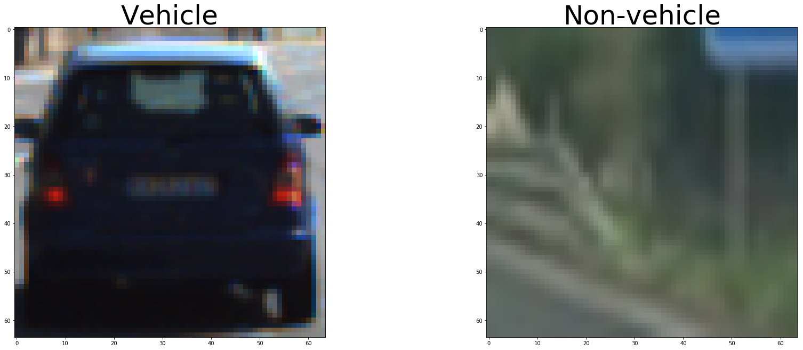
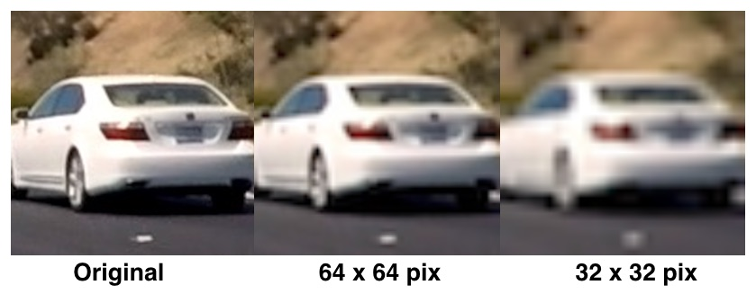
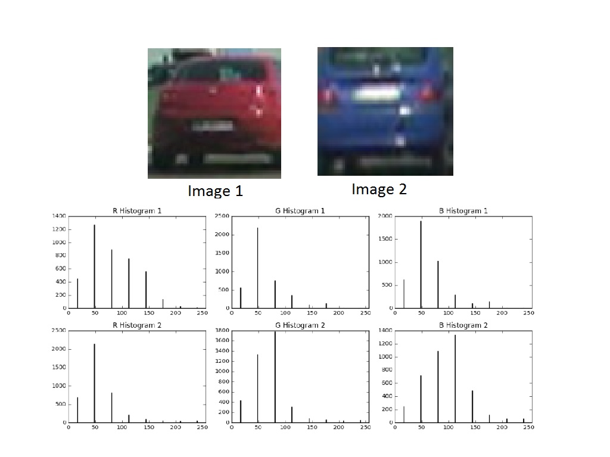
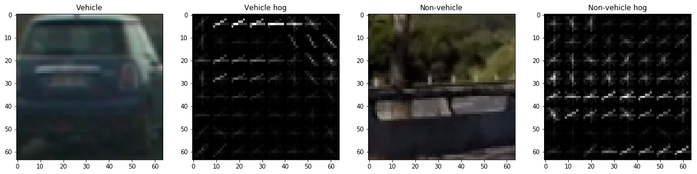
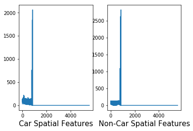
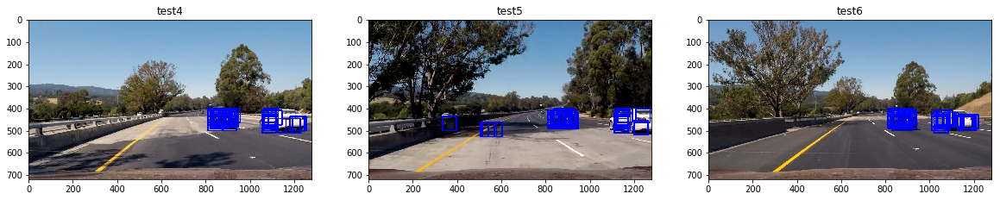
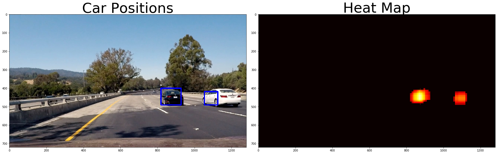
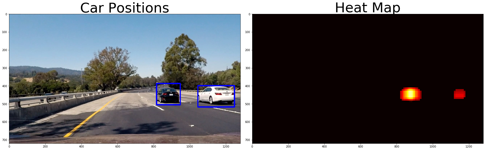

# Vehicle Detection
[](http://www.udacity.com/drive)

## Decscription

In this project, goal is to write a software pipeline to detect vehicles in a video. 

The goals / steps of this project are the following:

* Perform a Histogram of Oriented Gradients (HOG) feature extraction on a labeled training set of images and train a classifier Linear SVM classifier.
* Optionally, you can also apply a color transform and append binned color features, as well as histograms of color, to your HOG feature vector. 
* Note: for those first two steps don't forget to normalize your features and randomize a selection for training and testing.
* Implement a sliding-window technique and use your trained classifier to search for vehicles in images.
* Run your pipeline on a video stream (start with the test_video.mp4 and later implement on full project_video.mp4) and create a heat map of recurring detections frame by frame to reject outliers and follow detected vehicles.
* Estimate a bounding box for vehicles detected.

I haven't included the dataset in the repo. Please use below links to download the dataset.

Here are links to the labeled data for [vehicle](https://s3.amazonaws.com/udacity-sdc/Vehicle_Tracking/vehicles.zip) and [non-vehicle](https://s3.amazonaws.com/udacity-sdc/Vehicle_Tracking/non-vehicles.zip) examples to train your classifier.  These example images come from a combination of the [GTI vehicle image database](http://www.gti.ssr.upm.es/data/Vehicle_database.html), the [KITTI vision benchmark suite](http://www.cvlibs.net/datasets/kitti/), and examples extracted from the project video itself.   You are welcome and encouraged to take advantage of the recently released [Udacity labeled dataset](https://github.com/udacity/self-driving-car/tree/master/annotations) to augment your training data.  


As part of the optional challenge, I have added the project 4(https://github.com/dkarunakaran/carnd-advanced-lane-lines-p4) implementation to this. For the detailed explanation of the project4, Please visit my [medium](https://towardsdatascience.com/self-driving-car-nanodegree-advanced-lane-finding-9c806b277a31) post.


## Details

Dataset is downloaded from the above vehicle and non-vehicle links. Both vehicle and non-vehile images are downloaded to separate folder. Here is the count of the dataset.

```
Vehicle train images count: 8792
Non-vehicle train image count: 8968

```

vehicle and non-vehicle images as numpy array are loaded to the separate list using below function.

```
def get_dataset(rootdir):
    images = []
    for subdir, dirs, files in os.walk(rootdir):
        for file in files:
            if '.DS_Store' not in file:
                images.append(os.path.join(subdir, file))
                
    return list(map(lambda img: cv2.cvtColor(cv2.imread(img), cv2.COLOR_BGR2RGB), images))

```

Vehicle and Non-vehicle images:



There are various feature extraction techniques has been used to train the classifier to detect the cars efficiently.

### Spatial Binning


<p align="center">
  
  <b>(Picture obtained from course)</b>
</p>


While it could be cumbersome to include three color channels of a full resolution image, you can perform spatial binning on an image and still retain enough information to help in finding vehicles.

As you can see in the example above, even going all the way down to 32 x 32 pixel resolution, the car itself is still clearly identifiable by eye, and this means that the relevant features are still preserved at this resolution.

A convenient function for scaling down the resolution of an image is OpenCV's cv2.resize(). If you then wanted to convert this to a one dimensional feature vector, numpy's ravel() function can be used.


### Color histogram

In photography a histogram is simply a graphical representation of the number of pixels in the image that fall within a certian range, either luminance or color. For example for a normal luminance histogram the graph shows the number of pixels for each luminance or brightness level from black to white. The higher the peak on the graph the more pixels are at that luminance level. With a color histogram the principle is the same but instead of seeing the levels of black graphed you will now see the number of pixels for each of the three main colors.

A color histogram is a simply a histogram that shows the color level for each individual RGB color channel. 

If we had to, we could differentiate the two images based on the differences in histograms alone. As expected the image of the red car has a greater intensity of total bin values in the R Histogram 1 (Red Channel) compared to the blue car's R Histogram 2. In contrast the blue car has a greater intensity of total bin values in B Histogram 2 (Blue Channel) than the red car's B Histogram 1 features.

Differentiating images by the intensity and range of color they contain can be helpful for looking at car vs non-car images.

<p align="center">
  
  <b>(Picture obtained from course)</b>
</p>

### Histogram of oriented gradients(HOG)

A feature descriptor is a representation of an image or an image patch that simplifies the image by extracting useful information and throwing away extraneous information.

The histogram of oriented gradients (HOG) is a feature descriptor used in computer vision and image processing for the purpose of object detection. The technique counts occurrences of gradient orientation in localized portions of an image.

In the HOG feature descriptor, the distribution ( histograms ) of directions of gradients ( oriented gradients ) are used as features. Gradients ( x and y derivatives ) of an image are useful because the magnitude of gradients is large around edges and corners ( regions of abrupt intensity changes ) and we know that edges and corners pack in a lot more information about object shape than flat regions.




Next one is to choose the right parameters to train the classifier to predict the image, I have defined the parameter class to define these parameters.

Here is the choosen parameters.

```
Parameters(
        color_space = 'YCrCb',
        spatial_size = (16, 16),
        orient = 8,
        pix_per_cell = 8,
        cell_per_block = 2,
        hog_channel = 'ALL',
        hist_bins = 32,
        scale = 1.5,
        spatial_feat=True, 
        hist_feat=True, 
        hog_feat=True
)
```

Feature extraction varies with parameters. I have done feature extraction with various parameter combination and I found the above parameter combination is best suited for the feature extraction.




### Classifier

Support vector machines (SVMs) are a set of supervised learning methods used for classification, regression and outliers detection. I have decided to use LinearSVC as classifier this project. 

Here is the code for training the classifier:

```
sample_size = 8750
cars = vehicles[0:sample_size]
notcars = non_vehicles[0:sample_size]

car_features = list(map(lambda img: extract_features(img, params), cars))
notcar_features = list(map(lambda img: extract_features(img, params), notcars))


X = np.vstack((car_features, notcar_features)).astype(np.float64)                        
# Fit a per-column scaler
X_scaler = StandardScaler().fit(X)
# Apply the scaler to X
scaled_X = X_scaler.transform(X)

# Define the labels vector
y = np.hstack((np.ones(len(car_features)), np.zeros(len(notcar_features))))


# Split up data into randomized training and test sets
rand_state = np.random.randint(0, 100)
X_train, X_test, y_train, y_test = train_test_split(
    scaled_X, y, test_size=0.2, random_state=rand_state)

print('Using:',params.orient,'orientations',params.pix_per_cell,
    'pixels per cell and', params.cell_per_block,'cells per block')
print('Feature vector length:', len(X_train[0]))
# Use a linear SVC 
svc = LinearSVC()
# Check the training time for the SVC
t=time.time()
svc.fit(X_train, y_train)
t2 = time.time()
print(round(t2-t, 2), 'Seconds to train SVC...')
# Check the score of the SVC
print('Test Accuracy of SVC = ', round(svc.score(X_test, y_test), 4))
```


The cars and nor-cars images are loaded and extracted features using the above feature extraction techniques. These values are stored in car_features and notcar_features.We assumes that output of the carfeatures will be one and notcar_features is zero. 'y' value is filled based on that assumption. 'x' is the combination car_features and notcar_features list.

The StandardScaler assumes data is normally distributed within each feature and will scale them such that the distribution is now centred around 0, with a standard deviation of 1. 'x' values are transformed using the function and get the output scaled_X.


There are few helping libraries to split the dataset. 'train_test_split' funtion from 'sklearn' is one of them which help to split the dataset into train an test data for the classifier.


Finally LinearSVC is defined and pass the x_train and y_train for trainning the classifier. Once it's completed, test datset is used to check the accuracy of the classifier.

Classifier accuracy is around 99 percent on the test split of the dataset.

```
Using: 8 orientations 8 pixels per cell and 2 cells per block
Feature vector length: 5568
3.04 Seconds to train SVC...
Test Accuracy of SVC =  0.9911

```


### Sliding Window 

In the context of computer vision (and as the name suggests), a sliding window is rectangular region of fixed width and height that “slides” across an image. For each of these windows, we would normally take the window region and apply an image classifier to determine if the window has an object that interests us.



Here are three test images and we can see all the bounding boxes for where my classifier reported positive detections. You can see that overlapping detections exist for each of the two vehicles, and in two of the frames, there is a false positive detection on the middle of the road. In this exercise, you'll build a heat-map from these detections in order to combine overlapping detections and remove false positives.

In order to combine overlapping detections and remove false positives, heatmap and threahold limit are used. 

Here is the code for heatmap and threshold limit:

```
def add_heat(heatmap, bbox_list):
    # Iterate through list of bboxes
    for box in bbox_list:
        # Add += 1 for all pixels inside each bbox
        # Assuming each "box" takes the form ((x1, y1), (x2, y2))
        heatmap[box[0][1]:box[1][1], box[0][0]:box[1][0]] += 1

    # Return updated heatmap
    return heatmap# Iterate through list of bboxes
    
def apply_threshold(heatmap, threshold):
    # Zero out pixels below the threshold
    heatmap[heatmap <= threshold] = 0
    # Return thresholded map
    return heatmap
    
    
def heat_threshold(img, threshold, svc, X_scaler, windows_list, params):

    heat = np.zeros_like(img[:,:,0]).astype(np.float)
    # Add heat to each box in box list
    heat = add_heat(heat,windows_list)

    # Apply threshold to help remove false positives
    heat = apply_threshold(heat,threshold)

    # Visualize the heatmap when displaying    
    heatmap = np.clip(heat, 0, 255)

    # Find final boxes from heatmap using label function
    labels = label(heatmap)
    draw_img = draw_labeled_bboxes(np.copy(img), labels)
    
    return draw_img, heatmap    
    
```




The hog sub-sampling is more efficient method for doing the sliding window approach. The code only has to extract hog features once and then can be sub-sampled to get all of its overlaying windows. Each window is defined by a scaling factor where a scale of 1 would result in a window that's 8 x 8 cells then the overlap of each window is in terms of the cell distance. This means that a cells_per_step = 2 would result in a search window overlap of 75%. Its possible to run this same function multiple times for different scale values to generate multiple-scaled search windows. The hog sub-sampling helps to reduce calculation time for finding HOG features and thus provided higher throughput rate.

I have decided to choose stating position of the window search from 350px to 656px and cells_per_step reduced to one to get more accurate result.

As explained above, same heatmap and threshold with limit 1 techniqueue is used to combine overlapping detections and remove false positives.



Here is  the code for finding cars using hog sub-sampling window search:

```
def find_cars_hog_sub(img, ystart, ystop, svc, scaler, params, cells_per_step = 1):
    draw_img = np.copy(img)
    cspace = params.color_space
    
    img_tosearch = img[ystart:ystop,:,:]

    if cspace != 'RGB':
        if cspace == 'HSV':
            ctrans_tosearch = cv2.cvtColor(img_tosearch, cv2.COLOR_RGB2HSV)
        elif cspace == 'LUV':
            ctrans_tosearch = cv2.cvtColor(img_tosearch, cv2.COLOR_RGB2LUV)
        elif cspace == 'HLS':
            ctrans_tosearch = cv2.cvtColor(img_tosearch, cv2.COLOR_RGB2HLS)
        elif cspace == 'YUV':
            ctrans_tosearch = cv2.cvtColor(img_tosearch, cv2.COLOR_RGB2YUV)
        elif cspace == 'YCrCb':
            ctrans_tosearch = cv2.cvtColor(img_tosearch, cv2.COLOR_RGB2YCrCb)
    else: ctrans_tosearch = np.copy(img_tosearch)  
    
    if params.scale != 1:
        imshape = ctrans_tosearch.shape
        ctrans_tosearch = cv2.resize(ctrans_tosearch, (np.int(imshape[1]/params.scale), np.int(imshape[0]/params.scale)))
        
    ch1 = ctrans_tosearch[:,:,0]
    ch2 = ctrans_tosearch[:,:,1]
    ch3 = ctrans_tosearch[:,:,2]
    # Define blocks and steps as above
    nxblocks = (ch1.shape[1] // params.pix_per_cell) - params.cell_per_block + 1
    nyblocks = (ch1.shape[0] // params.pix_per_cell) - params.cell_per_block + 1 
    nfeat_per_block = params.orient*params.cell_per_block**2
    
    # 64 was the orginal sampling rate, with 8 cells and 8 pix per cell
    window = 64
    nblocks_per_window = (window // params.pix_per_cell) - params.cell_per_block + 1
    nxsteps = (nxblocks - nblocks_per_window) // cells_per_step
    nysteps = (nyblocks - nblocks_per_window) // cells_per_step
    
    # Compute individual channel HOG features for the entire image
    hog1 = get_hog_features(ch1, params.orient, params.pix_per_cell, params.cell_per_block, feature_vec=False)
    hog2 = get_hog_features(ch2, params.orient, params.pix_per_cell, params.cell_per_block, feature_vec=False)
    hog3 = get_hog_features(ch3, params.orient, params.pix_per_cell, params.cell_per_block, feature_vec=False)
    car_windows = []
    for xb in range(nxsteps):
        for yb in range(nysteps):
            ypos = yb*cells_per_step
            xpos = xb*cells_per_step
            # Extract HOG for this patch
            hog_feat1 = hog1[ypos:ypos+nblocks_per_window, xpos:xpos+nblocks_per_window].ravel() 
            hog_feat2 = hog2[ypos:ypos+nblocks_per_window, xpos:xpos+nblocks_per_window].ravel() 
            hog_feat3 = hog3[ypos:ypos+nblocks_per_window, xpos:xpos+nblocks_per_window].ravel() 
            hog_features = np.hstack((hog_feat1, hog_feat2, hog_feat3))
            xleft = xpos*params.pix_per_cell
            ytop = ypos*params.pix_per_cell
            # Extract the image patch
            subimg = cv2.resize(ctrans_tosearch[ytop:ytop+window, xleft:xleft+window], (64,64))
          
            # Get color features
            spatial_features = bin_spatial(subimg, size=params.spatial_size)
            hist_features = color_hist(subimg, nbins=params.hist_bins, bins_range=params.hist_range)
            # Scale features and make a prediction
            test_features = X_scaler.transform(np.hstack((spatial_features, hist_features, hog_features)).reshape(1, -1))    
            test_prediction = svc.predict(test_features)
            
            if test_prediction == 1:
                xbox_left = np.int(xleft*params.scale )
                ytop_draw = np.int(ytop*params.scale )
                win_draw = np.int(window*params.scale )
                cv2.rectangle(draw_img,(xbox_left, ytop_draw+ystart),(xbox_left+win_draw,ytop_draw+win_draw+ystart),(0,0,255),6) 
                car_windows.append(((xbox_left, ytop_draw+ystart),(xbox_left+win_draw,ytop_draw+win_draw+ystart)))
                
    return car_windows
    
```

### Pipeline video

Finally create the pipeline vide by processing the each frame of the image with above techniques and create the video out of the 
processed frames. 

find_cars_hog_sub function extract all the bounding boxes detected for the cars in the image. heat_threshold function is used to combine overlapping detections and remove false positives and produce the output with bounding box added to the image.

Here is the code for the pipeline:

```
def pipeline(img):
    ystart = 350
    ystop = 656
    threshold = 1
    car_windows = find_cars_hog_sub(img, ystart, ystop, svc, X_scaler, params)
    draw_img, heat_map = heat_threshold(img, threshold, svc, X_scaler, car_windows, params)
    
    return draw_img
    
```

Video:

<a href="http://www.youtube.com/watch?feature=player_embedded&v=_PjVU8I6sn0
" target="_blank"></a>


### Discussion

* Even thpough my code is detecting the vehicle accurately. Sometimes it detects other parts of the road as vehicle as well. I have to improve this by trainining my classifer with huge dataet or would like to use Deep Learning approach as per the [link](https://towardsdatascience.com/vehicle-detection-and-tracking-44b851d70508).

* My project is depend on on Spatial and Hog Features. It's not giving all the time better result as it detected non-vehicle images as vehicle. I would like to use more feature extraction technique to increase the accuracy.


### Optional challenge

I have added advanced lane findings code to the vehicle detection project to complete the optional challenge.

<a href="http://www.youtube.com/watch?feature=player_embedded&v=nrKhsjDneBc
" target="_blank"></a>


